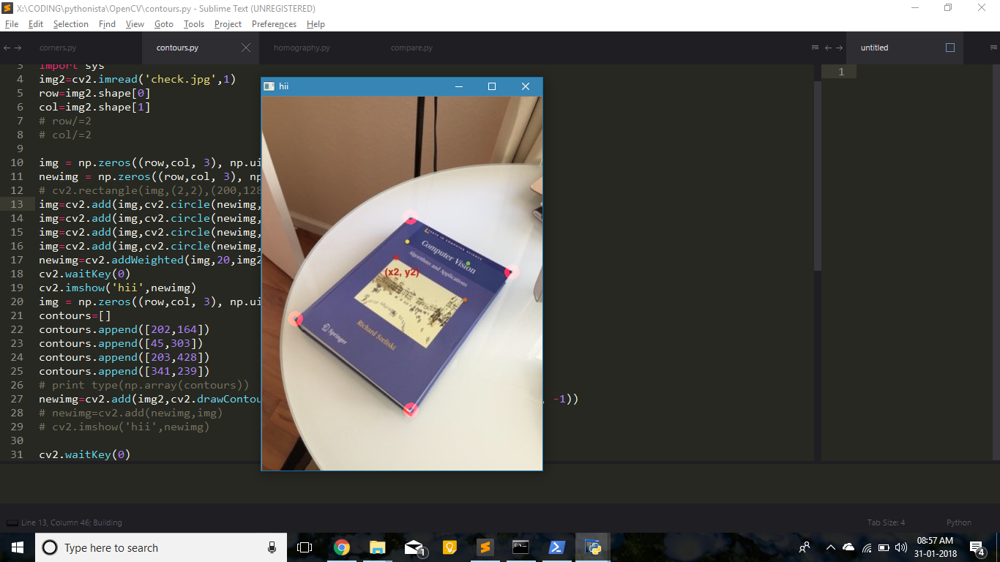

# BhejoBooks

Part of a bigger solution for sharing books within small communities.

## The Why

Solution presented at Rajasthan DigiFest Hackathon 2018. **Made it to top 5 projects.**

## The What

A book identification program for identifying book(s) in a photograph.

## The How

Works simply by clicking a picture of the book cover. The program identifies the book through multiple Computer Vision Techniques: -
1. **Corner Detection**: Identify the book within the image
    
    

    

2. **Homography**: Convert the skewed image to a square
    
    

3. **Semantic Segmentation**: Compare incoming image with database images.

> Whenever the program encounters a new book, it asks the uploading user to enter information about the book.
>
> This information may be stored in a central location. Hence the database is updated globally and accessible to all communities that wish to use the application. 😊

